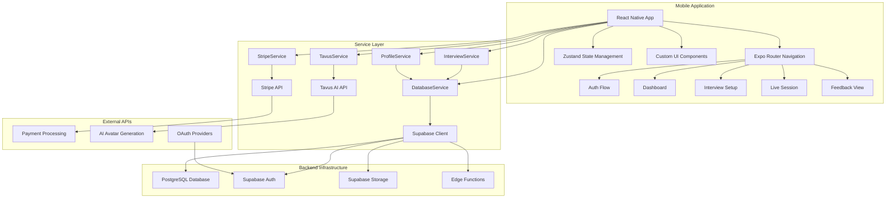
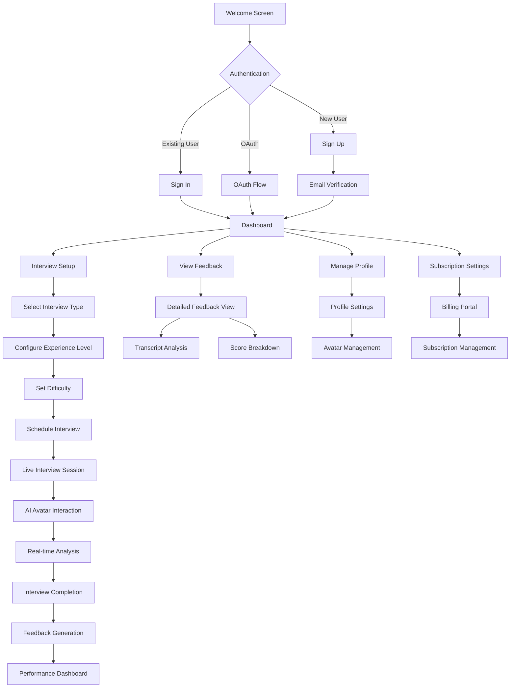
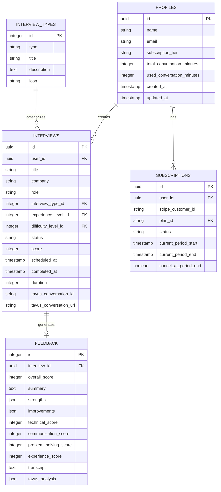
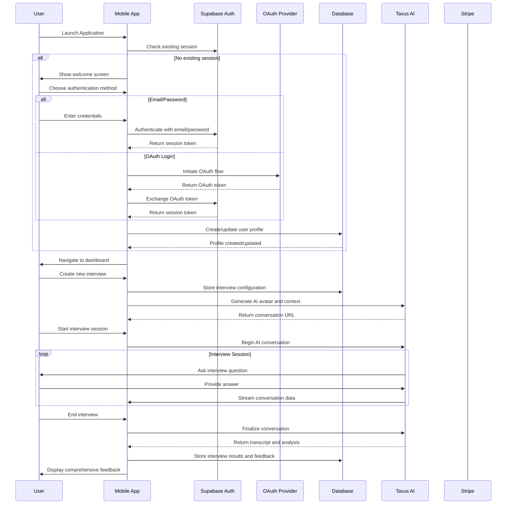
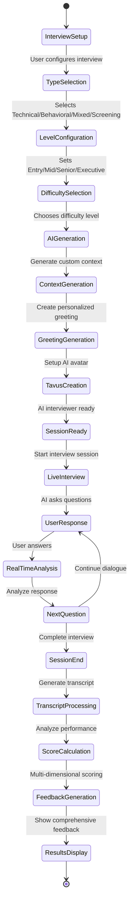

# InterviewAI Mobile

> AI-powered interview practice platform for mobile devices

A comprehensive React Native mobile application that provides AI-driven interview practice with real-time feedback, built with Expo, Supabase, Tavus AI, and modern mobile development best practices.

## 🚀 **Core Features**

### **Authentication & User Management**
The app provides secure authentication through multiple channels, supporting both traditional email/password login and OAuth integration with Google and GitHub. User profiles include avatar management, subscription tier tracking, and personalized preferences. All authentication tokens are stored securely using device-level encryption.

### **Interview Experience**
Users can create customized interview sessions through a comprehensive multi-step setup process. The system supports four main interview types: Technical, Behavioral, Mixed, and Screening. Each interview can be configured for different experience levels (Entry, Mid, Senior, Executive) and difficulty settings. Live interview sessions feature real-time AI interviewer interactions with full media controls for video and audio management.

### **Advanced AI Integration**
The platform integrates Tavus AI to provide realistic AI avatars that serve as interviewers. Each interview type has dedicated AI personas that generate custom conversational contexts and greetings based on the specific role and company. The system supports real-time conversation analysis and dynamic feedback generation during interviews.

### **Comprehensive Feedback System**
After each interview, the system provides detailed multi-dimensional analysis covering Technical skills, Communication abilities, Problem-solving approach, and Experience relevance. Users receive comprehensive feedback with identified strengths and improvement areas, complete interview transcripts with AI analysis, and visual score representations for tracking progress over time.

### **Dashboard & Analytics**
The main dashboard provides users with performance overviews, interview statistics, completion rates, and progress tracking. The system monitors conversation minute usage against subscription limits and displays recent activity with feedback summaries. Users can track their improvement trends and receive personalized insights.

### **Subscription & Billing**
Stripe integration handles secure payment processing and subscription management across multiple tiers: Free, Intro, Professional, and Executive plans. The system tracks conversation minute allocations, provides a complete billing portal for subscription management, and maintains detailed payment history and invoice management.

### **Modern UI/UX**
The application supports both iOS and Android platforms with web compatibility through Expo. Users can toggle between dark and light themes, with responsive design that adapts to different screen sizes. The interface features smooth tab-based navigation, modern glass morphism effects, gradient backgrounds, and comprehensive accessibility support.

### **Data Management**
All data is managed through Supabase's PostgreSQL database with real-time capabilities. The application maintains full TypeScript coverage for robust development, uses Zustand for efficient state management, implements encrypted local storage for sensitive data, and provides offline support with local caching and sync capabilities.

## 📱 **Technology Stack**

### **Frontend Architecture**
- **Framework**: React Native + Expo (~51.0.28)
- **Language**: TypeScript (~5.8.3) for type safety
- **Navigation**: Expo Router with file-based routing system
- **State Management**: Zustand for lightweight state handling
- **Styling**: React Native StyleSheet with Linear Gradients
- **Icons**: Lucide React Native for consistent iconography
- **UI Components**: Custom component library with theme support

### **Backend Services**
- **Database**: Supabase PostgreSQL with Auth, Storage, and Edge Functions
- **AI Integration**: Tavus AI for realistic avatar conversations
- **Payments**: Stripe for subscription and billing management
- **Authentication**: Supabase Auth with OAuth provider support
- **Media Handling**: Expo AV for audio/video functionality
- **Secure Storage**: Expo SecureStore for sensitive data encryption

### **Development Infrastructure**
- **Build System**: Expo Application Services (EAS) for builds and deployment
- **Code Quality**: ESLint with Expo configuration standards
- **Version Control**: Git with structured branching workflow
- **Distribution**: EAS Build for iOS/Android app store deployment

## 🏗️ **System Architecture**

The InterviewAI Mobile application follows a layered architecture pattern with clear separation between the presentation layer, business logic, and data persistence. The system integrates multiple external services to provide a comprehensive interview practice experience.



## 🔄 **User Journey Flow**



## 💾 **Database Architecture**



## 🔧 **Setup & Configuration**

### **Prerequisites**
- Node.js 18+ with npm or yarn
- Expo CLI (`npm install -g @expo/cli`)
- iOS Simulator or Android Emulator
- Supabase account for backend services
- Stripe account for payment processing
- Tavus account for AI avatar functionality

### **Installation Process**

1. **Repository Setup**
   ```bash
   git clone <repository-url>
   cd interviewai-mobile
   npm install --legacy-peer-deps
   ```

2. **Environment Configuration**
   ```bash
   cp .env.example .env
   ```
   
   Configure your environment variables:
   ```env
   # Supabase Configuration
   EXPO_PUBLIC_SUPABASE_URL=https://your-project.supabase.co
   EXPO_PUBLIC_SUPABASE_ANON_KEY=your-anon-key
   
   # Tavus AI Configuration
   EXPO_PUBLIC_TAVUS_API_KEY=your-tavus-api-key
   EXPO_PUBLIC_TAVUS_TECHNICAL_REPLICA_ID=replica-id
   EXPO_PUBLIC_TAVUS_TECHNICAL_PERSONA_ID=persona-id
   EXPO_PUBLIC_TAVUS_BEHAVIORAL_REPLICA_ID=replica-id
   EXPO_PUBLIC_TAVUS_BEHAVIORAL_PERSONA_ID=persona-id
   EXPO_PUBLIC_TAVUS_MIXED_REPLICA_ID=replica-id
   EXPO_PUBLIC_TAVUS_MIXED_PERSONA_ID=persona-id
   EXPO_PUBLIC_TAVUS_SCREENING_REPLICA_ID=replica-id
   EXPO_PUBLIC_TAVUS_SCREENING_PERSONA_ID=persona-id
   
   # Stripe Configuration
   EXPO_PUBLIC_STRIPE_PUBLISHABLE_KEY=your-stripe-publishable-key
   ```

3. **Database Setup**
   - Create Supabase project and configure database schema
   - Set up Row Level Security (RLS) policies
   - Deploy edge functions for webhook handling
   - Configure authentication providers

4. **Development Server**
   ```bash
   npm start
   ```

5. **Platform Testing**
   - iOS: Press `i` or scan QR with Camera app
   - Android: Press `a` or scan QR with Expo Go app
   - Web: Press `w` for browser testing

## 🔐 **Authentication & Session Management**

The authentication system provides secure, multi-channel access with automatic session management and seamless user experience across app restarts and device changes.

### **Authentication Methods**
The system supports traditional email/password authentication with secure password hashing and validation. OAuth integration provides one-click access through Google and GitHub providers, with automatic profile creation and linking. All authentication flows include proper error handling and user feedback.

### **Session Security**
Authentication tokens are stored using device-level encryption through Expo SecureStore, ensuring sensitive data never appears in plain text. The system implements automatic token refresh to maintain seamless user experience, with fallback mechanisms for offline scenarios and network interruptions.

### **Profile Synchronization**
User profiles are automatically created and synchronized across the authentication flow, with subscription tier detection and preference restoration. The system maintains consistency between authentication providers and internal user data.



## 🎯 **Interview Process Workflow**

The interview system guides users through a comprehensive process from initial setup to detailed feedback analysis. Each step builds upon the previous to create a personalized and effective interview experience.

### **Setup Phase**
Users begin by configuring their interview preferences through a multi-step wizard. The system collects information about the target role, company, interview type (Technical, Behavioral, Mixed, or Screening), experience level (Entry, Mid, Senior, Executive), and difficulty preference. This information drives the AI generation process that follows.

### **AI Generation Phase**
Once configuration is complete, the system generates personalized content using advanced AI models. This includes creating custom conversational contexts tailored to the specific role and company, generating personalized greetings that feel natural and relevant, and setting up dedicated Tavus AI avatars with appropriate personas for the interview type.

### **Live Interview Phase**
The actual interview session provides real-time interaction with AI avatars that conduct realistic interviews. Users engage in natural conversation while the system provides media controls for video and audio management. Real-time analysis occurs throughout the session, capturing response quality, communication patterns, and technical competency indicators.

### **Analysis & Feedback Phase**
After session completion, the system processes the entire conversation to generate comprehensive feedback. This includes transcript analysis, multi-dimensional scoring across technical, communication, problem-solving, and experience categories, and detailed insights with actionable improvement recommendations.



## ⚡ **Real-Time Features & AI Processing**

### **Live Interview Processing**
During active interview sessions, the system maintains real-time connections with Tavus AI for seamless conversation flow. Audio and video streams are processed continuously, with conversation data captured and analyzed for immediate feedback generation. The system handles network interruptions gracefully with automatic reconnection and session recovery.

### **AI Integration Pipeline**
The Tavus AI integration operates through a sophisticated pipeline that begins with context generation based on user-specified roles and companies. Custom personas are created for each interview type, with specialized prompting for technical, behavioral, mixed, and screening scenarios. Real-time conversation analysis provides immediate insights into response quality and communication patterns.

### **Feedback Generation Process**
Post-interview analysis utilizes multiple AI models to process conversation transcripts and generate comprehensive feedback. The system performs multi-dimensional scoring across technical competency, communication effectiveness, problem-solving approach, and experience relevance. Detailed insights are generated with specific improvement recommendations and strength identification.

### **Subscription & Usage Management**
The subscription system operates through Stripe integration with real-time usage tracking and automated billing cycles. Conversation minutes are allocated based on subscription tiers (Free: 25 minutes, Intro: 100 minutes, Professional: 500 minutes, Executive: unlimited). The system provides real-time usage monitoring with automatic notifications as users approach their limits.

## 📊 **Performance & Security**

### **Application Performance**
The application maintains optimal performance across platforms with a bundle size of approximately 15MB including the React Native runtime. Cold start times average 2.5 seconds, which is standard for React Native applications. Memory usage stays within 80MB during normal operation, supporting devices running iOS 13+ and Android 6+.

### **Security Implementation**
Authentication tokens are stored using device-level encryption through Expo SecureStore. The backend implements Row Level Security (RLS) through Supabase, ensuring users can only access their own data. All API communications are enforced over HTTPS, with comprehensive input validation and SQL injection protection through parameterized queries.

### **Privacy & Compliance**
The system follows GDPR-compliant data handling practices with user data export and deletion capabilities. The platform maintains transparent privacy policies and implements minimal data collection principles with secure retention policies.

## 🔄 **Component Integration & Data Flow**

### **Service Layer Architecture**
The application's service layer provides abstraction between the UI components and external APIs. DatabaseService handles all Supabase interactions including CRUD operations for interviews, profiles, and feedback. InterviewService manages the complete interview lifecycle from creation through completion. ProfileService handles user data management and subscription tracking. StripeService manages payment processing and billing operations. TavusService coordinates AI avatar interactions and conversation management.

### **State Management Strategy**
Zustand provides lightweight state management with automatic persistence for critical data. Authentication state is maintained globally with automatic session restoration. Theme preferences are persisted locally with system-wide application. Interview data is cached locally during sessions with automatic cloud synchronization. Subscription information is synchronized in real-time with billing events.

### **Real-Time Data Synchronization**
The system maintains real-time synchronization between local state and cloud data through Supabase's real-time subscriptions. Interview progress is continuously synchronized during sessions. Subscription changes are immediately reflected across the application. Feedback updates appear instantly when processing completes. User profile changes propagate immediately to all connected devices.

## 🚀 **Development Workflow**

### **Available Commands**
```bash
npm start              # Start Expo development server with hot reload
npm run android        # Launch Android development build with debugging
npm run ios            # Launch iOS development build with debugging
npm run web            # Launch web development server for browser testing
npm run lint           # Run ESLint code analysis with auto-fix suggestions
npm run reset          # Clear Expo cache and restart development server
```

### **Build & Deployment Process**
```bash
# Development builds for internal testing
eas build --profile development --platform ios
eas build --profile development --platform android

# Production builds optimized for app stores
eas build --profile production --platform ios
eas build --profile production --platform android

# Automated app store submission
eas submit --platform ios
eas submit --platform android
```

## 📈 **System Monitoring**

The application includes comprehensive monitoring through Expo Application Services analytics, with built-in error boundary handling for crash prevention. The CI/CD pipeline uses EAS Build for automated builds and testing, with over-the-air (OTA) update capabilities for rapid deployment of non-native changes.

## 📚 **API Documentation**

The system provides well-structured service layers including DatabaseService for Supabase operations, InterviewService for interview management, ProfileService for user profile operations, and StripeService for payment processing. Each service maintains comprehensive TypeScript definitions and error handling.

## 🔗 **External Integrations**

### **Supabase Backend**
Provides PostgreSQL database with real-time subscriptions, authentication with multiple OAuth providers, file storage for avatars and recordings, and edge functions for serverless processing.

### **Tavus AI Platform**
Handles AI avatar creation and management, real-time conversation processing, transcript generation and analysis, and multi-persona support for different interview scenarios.

### **Stripe Payment Processing**
Manages subscription lifecycle, secure payment processing, invoice generation and management, and webhook handling for real-time subscription updates.

---

**Built with modern mobile development practices for scalable, secure, and engaging interview preparation experiences.**
